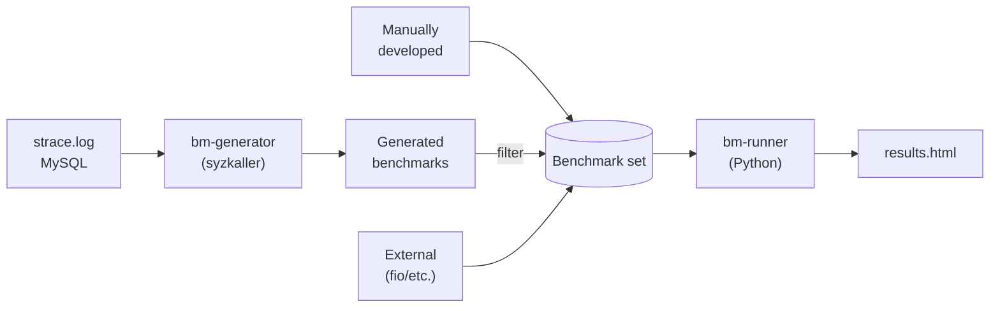

# CSB: Container Scalability Benchmarks

CSB is a framework for generating benchmarks and benchmarking systems scalability.

It consists of the following components:

- [bm-runner][] a Python framework uses [benchkit][] and runs benchmarks based on JSON [config][]
- [bm-generator][] extends [syzkaller] and uses [tmplr][] to generate system calls based benchmarks
- [bench][] a set of manual and auto-generated C benchmarks




## Getting started

A good place to start is to try to run a dummy benchmark. Read [bm-runner][]
to setup the environment and learn how to run CSB benchmarks.
If you are too eager and feeling adventurous run `./run.sh` and see what happens.


## Framework Overview
```
CSB
├── .agents             # AI agents information
│   └── skills          # skills for efficiently using CSB from AI agents
├── bench               # builtin C benchmarks
│   └── targets         # header files that implement the benchmarking skeleton, each header is a benchmark
├── bm-generator        # benchmark generation tool(s) based on syzkaller & tmplr
├── bm-runner           # python framework that extends bechkit and executes builtin/external benchmarks
├── config              # JSON configuration files. These files are used as an input of bm-runner
├── deps                # Submodules
├── doc                 # markdown files for detailed documentation
├── helpers             # helper scripts used for development and formatting
└── scripts             # scripts that are used by the framework
    ├── adapters        # scripts used to transform external benchmarks output into a complying format
    ├── fg-diff         # scripts used for selecting a set of distinct microbenchmarks
    └── plugins         # scripts used as an additional steps by some of the benchmarks
```

## Supported Operating systems/Architectures

The current version has been tested with:

- [openEuler](https://www.openeuler.org/en/) v22.03 (LTS-SP4)
- [ubuntu](https://ubuntu.com/) 22.04.5 LTS

The auto-generated benchmarks in this repository are generated for
[AArch64](https://en.wikipedia.org/wiki/AArch64). If you wish to
generate benchmarks for a different architecture then you
can run [bm-generator][] on the target architecture. At
the moment, the tooling in [bm-generator][] is experimental.

## AI Agent skills.

CSB includes a number of skills that can be used by AI agents to
efficiently run the benchmarks and analyse their results. Please
check agents [documentation](doc/agents.md) for more information.

Running container scalability experiments with help of agents can be
as simple as: "Use $csb-remote to run experiment
config/rocksdb/bm_min_rocks_write_fcntl_5_0.json on host
<remote-server>, and analyze the results."

## Releases

Releases are tracked in [CHANGELOG](CHANGELOG.md).

## Contributing
CSB is in its early stages. The current version is a prototype.
If you encounter issues please report them in [CSB-issues](https://github.com/open-s4c/CSB/issues).
You can also add feature requests. Once the architecture is stable we will publish
a complete developer guide and accept PRs. Current development notes are tracked
in [doc/development.md](doc/development.md).

[benchkit]: https://github.com/open-s4c/benchkit
[tmplr]: https://github.com/open-s4c/tmplr
[syzkaller]: https://github.com/open-s4c/syzkaller/tree/s4c/csb-gen
[bm-runner]: doc/bm-runner.md
[bm-generator]: doc/bm-generator.md
[bench]: doc/bench.md
[config]: doc/bm-config.md
